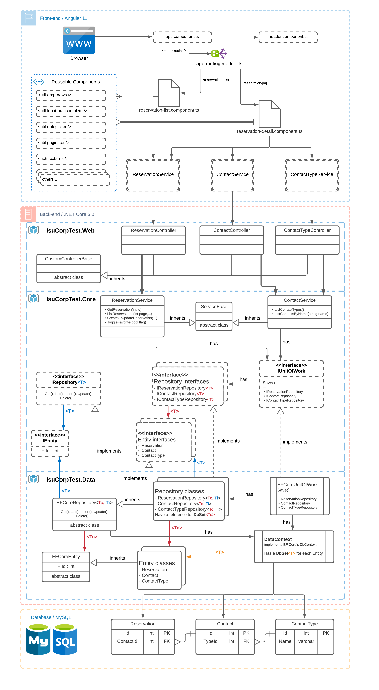

# ISUCorp Test

Angular + .NET 5 + EFCore + MySQL

### Dependencies

- Docker
- node.js
- .NET 5

### Using docker database

```bash
# To create the containers for the first time
docker run --name isucorp-mysql -p 3306:3306 -d \
  -e MYSQL_DATABASE=test \
  -e MYSQL_USER=test \
  -e MYSQL_PASSWORD=test \
  -e MYSQL_ROOT_PASSWORD=test \
  mysql:8.0.17

docker run --name isucorp-adminer -p 8080:8080 -d \
  --link isucorp-mysql:db \
  adminer

# To start all three containers (if they stop after restarting the computer):
docker start isucorp-mysql isucorp-adminer

# To stop (and delete) all three containers:
docker stop isucorp-mysql isucorp-adminer
docker rm isucorp-mysql isucorp-adminer
```

### Running the server

```sh
cd server

# Install project dependencies
dotnet restore

# Start server
dotnet run --project IsuCorpTest.Web
```

### Running the client

```sh
cd client

# Install project dependencies
yarn

# Start client with dev mode
yarn start
```

## Architecture

If you are checking this from GitHub repo README.md page, I recommend to set the page zoom to 300% (on Google Chrome)


